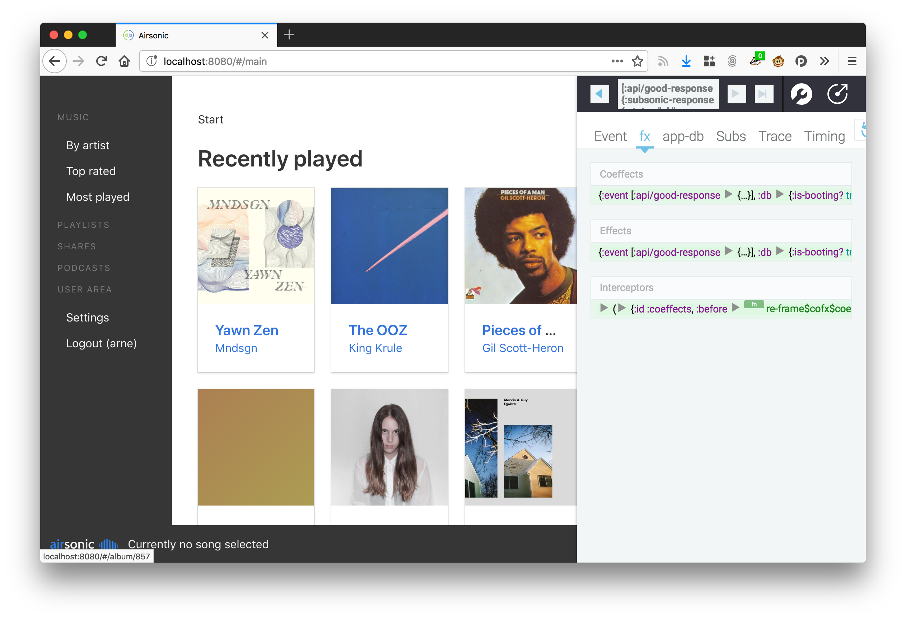

# Airsonic Web Client [](https://travis-ci.org/heyarne/airsonic-ui) [](https://circleci.com/gh/heyarne/airsonic-ui)

This repository contains an alternative web frontend for [airsonic](https://github.com/airsonic/airsonic). The goal is to eventually be able to fully replace the current web interface.

## Implemented so far

* Login with persisting credentials
* Browse your library by newest / most recently played / starred
* Browse artists alphabetically
* A currently playing queue with next, previous, repeat and shuffle
* Information about the current track with the ability to seek

## Development

The project is written in [ClojureScript](https://clojurescript.org/) and uses [re-frame](https://github.com/Day8/re-frame) for structure and peace of mind. The build tool is [shadow-cljs](https://shadow-cljs.github.io/docs/UsersGuide.html), which offers nice editor integration and interoparibility with the whole JavaScript ecosystem.
If you haven't worked with re-frame: I highly recommend it. Good resources are the project's [docs](https://github.com/Day8/re-frame/tree/master/docs) and a [post about its building blocks](https://purelyfunctional.tv/guide/re-frame-building-blocks/).

To build the project make sure you have Node.js (v6.0.0), npm and Java 8 installed in your system.

```
# after cloning the project, first install all dependencies
$ npm install

# start a continuous build with hot-code-reloading and continuous testing
# first build takes a while. open http://localhost:8080
$ npm run dev
```

### Editor integration

Integrating shadow-cljs with your editor helps tremendously with development. After having run `npm run dev` as described above you can connect to the REPL and get features like in-editor code execution and code completion / documentation lookup. For further information see [this part of the shadow-cljs user guide](https://shadow-cljs.github.io/docs/UsersGuide.html#_editor_integration), which contains instructions for Emacs, Atom, VSCode and other editors. Make sure to open `localhost:8080` in the browser to execute ClojureScript code.

### re-frame-10x

re-frame-10x is a debugger that is bundled with the app in development mode. Once you have the build running, hit `Ctrl + h` and the re-frame-10x window will show up:



It provides you with tools to inspect the state of the application, undo and replay events, debug performance issues and more.

## Tests

This project uses [karma](https://karma-runner.github.io/) for tests. Make sure to have Google Chrome installed, otherwise the watcher will time out.

```
# run tests once
$ npm test
```

**Note:** If you want nice console output in your tests, make sure to `(enable-console-print!)`. You can call `println` afterwards like you're used to.

## Deployment

```
# build and optimize the code once for production
$ npm run build

# runs npm run build and publishes everything via gh-pages
$ npm run deploy
```

**Note:** If you have a continuous build running and run `npm run build` or `npm run deploy`, it will delete the compiled tests, causing the continuous tests to not run anymore. This can be fixed by running `npm test` again.

All build artifacts land in `/public`. Don't change anything in there as changes will be overwritten.
